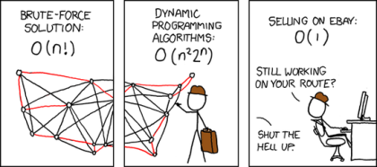

# 비선형 자료구조

## 그래프
정점과 간선으로 구성된 객체의 집합을 의미한다.

### 오일러 경로
- 모든 간선을 한 번씩 방문하는 유한 그래프. 한붓그리기와도 같다.

### 해밀턴 경로
- 모든 정점을 한 번씩 방문하는 유한 그래프이다.

- 모든 정점을 방문하고 처음의 정점으로 돌아오면 해밀턴 순환이라고 하며, 이 중 최단 거리를 찾는 문제를 외판원 문제(TSP, Traveling Salesman Problem)라고 한다.

  외판원 문제를 브루트 포스로 풀면 $O(n!)$이고, 다이나믹 프로그래밍을 이용해 $O(n^22^n)$까지 최적화할 수 있다.

<center>

  
</center>

### 그래프 순회
&nbsp;그래프의 각 정점을 방문하는 것을 의미하며, 크게 깊이 우선 탐색(DFS, Depth First Search)과 너비 우선 탐색(BFS, Breadth First Search)으로 나뉜다.

이미지 집어넣기
```python
graph = {
    1: [2, 3, 4],
    2: [5],
    3: [5],
    4: [],
    5: [6, 7],
    6: [],
    7: [3]
}
```

#### 깊이 우선 탐색
&nbsp;주로 스택이나 재귀로 구현한다. 재귀로 구현하면 좀 더 간단하게 표현할 수 있다.

1. 재귀
```python
def recursive_dfs(v, discovered=[]):
    discovered.append(v)
    for nxt in graph[v]:
        if nxt not in discovered:
            discovered = recursive_dfs(nxt, discovered)

    return discovered
```

2. 스택


#### 너비 우선 탐색